# Semantic search in GeoNetwork

Experiment setting up semantic search in GeoNetwork with ElasticSearch.

## Mapping

Un champ de type `dense_vector` est ajouté au mapping de l'index:

```json
      "text_vector": {
        "type": "dense_vector",
        "dims": 768,
        "index": true,
        "similarity": "cosine"
      },
```

Ici, le nombre de dimensions dépend du modèle utilisé.


## Indexation

Le champ contient un calcul des embeddings "Un embedding (ou plongement lexical en français) est la représentation vectorielle d'un texte".


### Quel modèle?

* `nomic-embed-text`: anglais
* `nomic-embed-text-v2-moe`: multilingue, 768 dimensions
* `gte-multilingual-base` (ou `bge-m3`): multilingue, 1024 dimensions

### Calcul des embeddings

Temps de calcul avec un modèle en local avec `ollama/nomic-embed-text` ou `ollama/bge-m3`:
* 50-400ms pour le titre
* 2-15s pour le titre + résumé


3 approches:
* Dans Elasticsearch avec un ingester 
* synchrone: à la sauvegarde de la fiche - on sélectionne les champs dont on veut une représentation vectorielle
* asynchrone: ...


#### Elasticsearch `_inference` (si on a une licence)

Dans Elasticsearch, on peut brancher directement des models d'inference pour calculer les embeddings à la volée:

```bash
curl -X PUT http://localhost:9200/_inference/text_embedding/ollama-embeddings -H "Content-Type: application/json" -d' 
{
  "service": "ollama",
  "service_settings": {
    "url": "http://localhost:11434",
    "model": "nomic-embed-text"
  }
}'
```

#### Dans GeoNetwork, avant envoi dans l'index

Calcule de l'embedding en Java et l'envoyer à Elasticsearch avec le document.

Demander l'analyse à Ollama pour un certain modèle :
```json
POST http://localhost:11434/api/embeddings 
{
  model: 'bge-m3',
  prompt: 'Plan de secteur en vigueur (version coordonnée vectorielle)'
}
```

Création du document pour l'index avec le champ `text_vector` contenant l'embedding :
```json
{ 
  "resourceTitleObject": {
    "defaul": "Plan de secteur en vigueur (version coordonnée vectorielle)"
    },
  "text_vector": [0.1, 0.3, ...],
  ...
}
```


## Recherche

kNN search https://www.elastic.co/docs/solutions/search/vector/knn est une recherche de similarité qui permet de trouver les documents les plus proches d'une requête vectorielle.

```json
{
  "knn": {
    "field": "text_vector",
    "query_vector": [-5, 9, -12],
    "k": 10,
    "num_candidates": 100
  },
  "_source": ["resourceTitleObject.default"]
}
```

Idem, il faut convertir le text en embedding. 

Note:
* `k` est le nombre de document retourné (il y en aura toujours)
* `min_score` peut être utiliser pour se limiter à des documents assez proche
* on ne peut pas le faire dans Kibana (car on n'a pas le modèle).


### Exemples

* plonger (`min_score = 0.8` = 0 résultat)

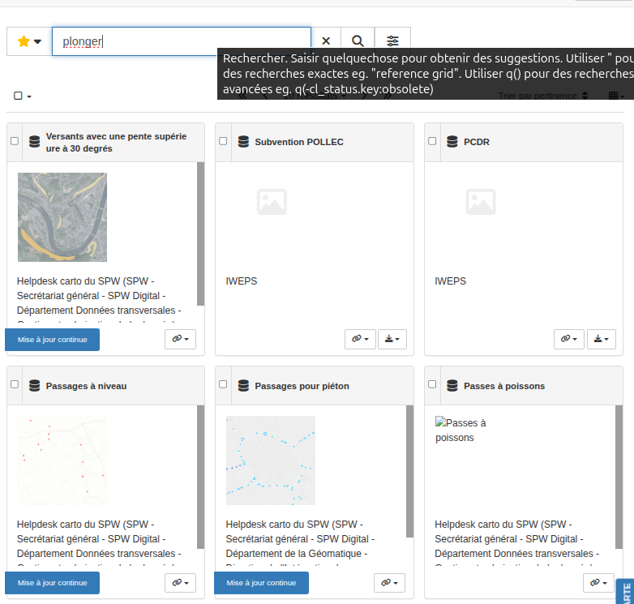


* terre frelatée

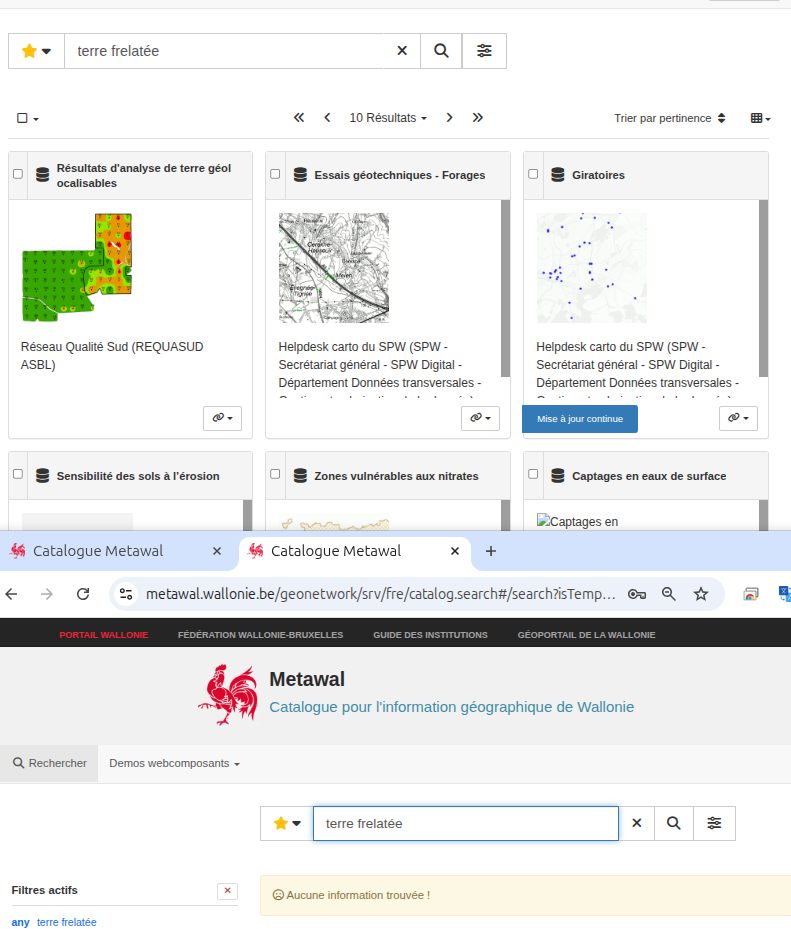


* ortho période après 2016

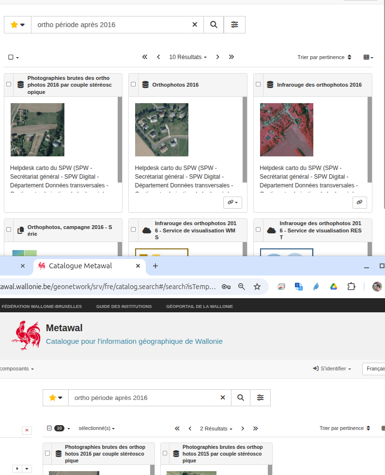

* ortho entre 2012 et 2014

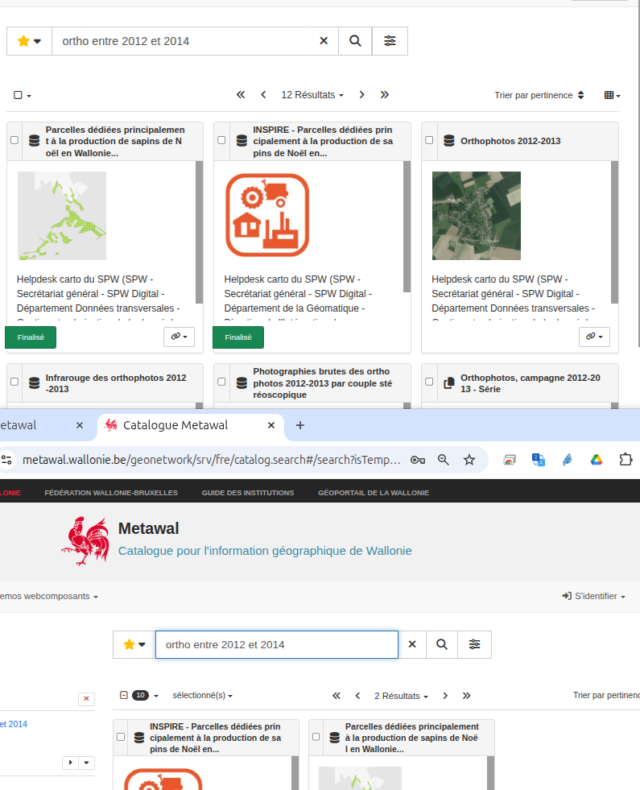


* circuits vélo

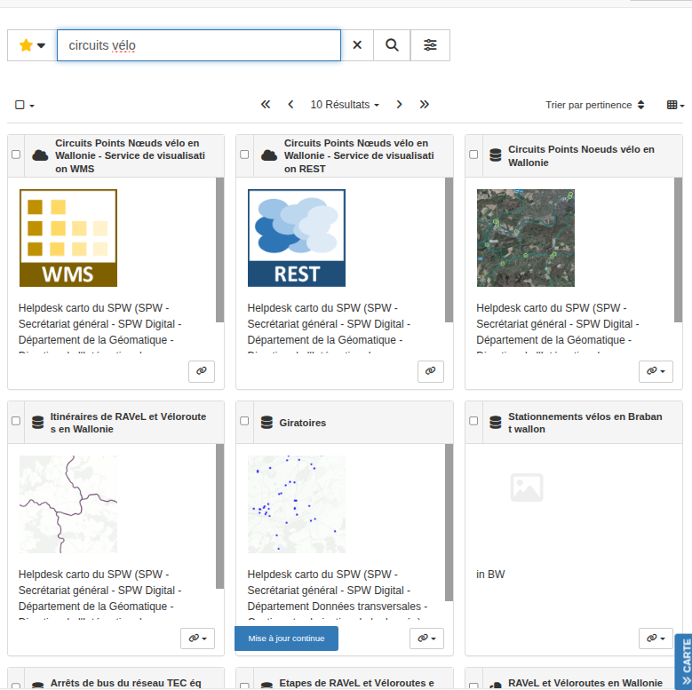


* parcours en vélo
* balades en vélo
* excursions en vélo
* petite escapade en cycle
* petite escapade sur l'eau

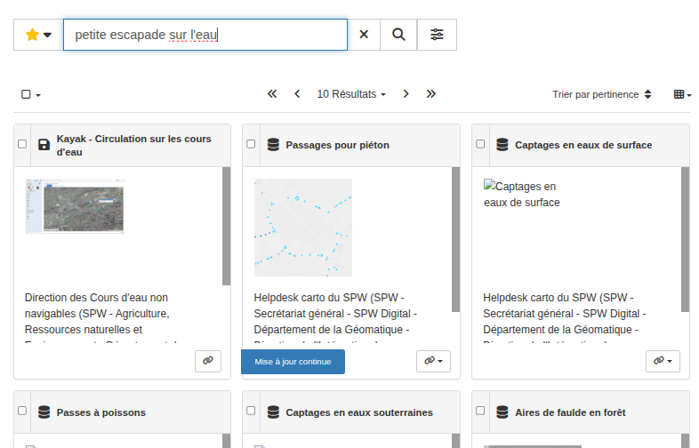


* impact du réchauffement climatique sur les paysans

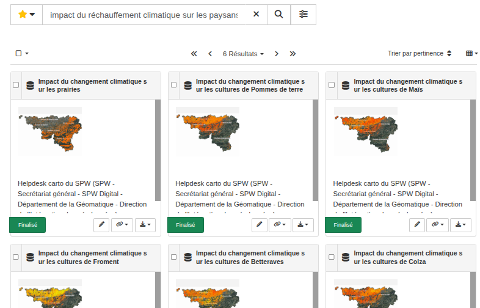

* impact du réchauffement climatique sur les patates

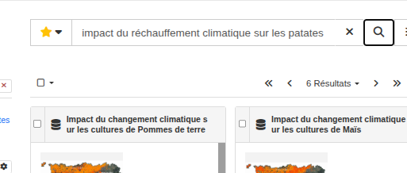

* impact du réchauffement climatique sur les solanacées

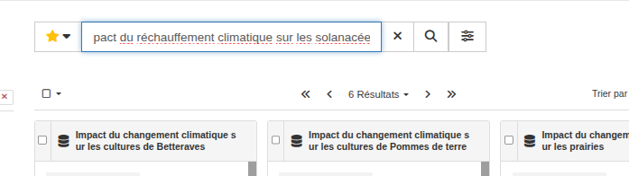

* impact du réchauffement climatique sur les céréales

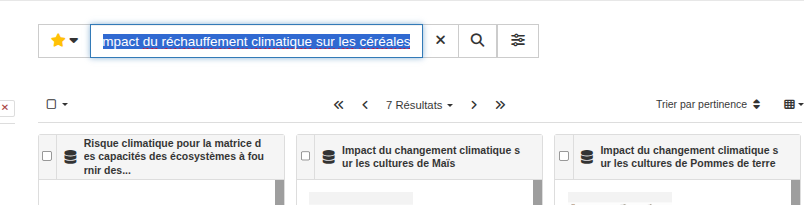
 
* passage des salmonidés

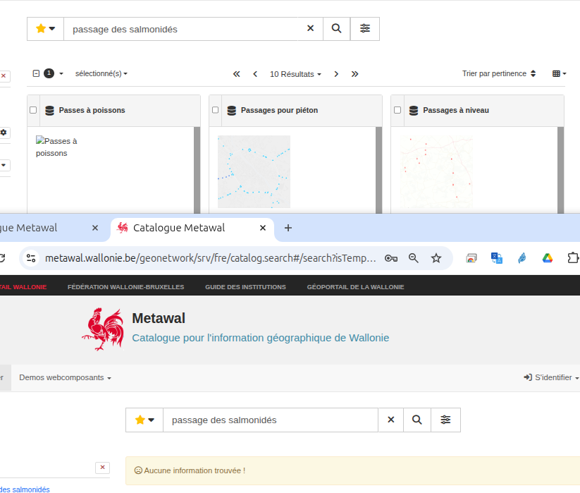

* 188069ae-b319-41d3-8490-c16f8311c046 fonctionne pas bien


### Requête

```json
{
    "knn": {
        "field": "text_vector",
        "query_vector": "Impact du changement climatique sur les prairies",
        "k": 10,
        "num_candidates": 100,
      // TODO: Inject filter
    },
    "from": 0,
    "size": 30,
    "sort": [
        "_score"
    ],
    "query": {
        "function_score": {
            "boost": "5",
            "functions": [
                {
                    "filter": {
                        "match": {
                            "resourceType": "series"
                ...
                        "match": {
                            "cl_status.key": "superseded"
                        }
                    },
                    "weight": 0.3
                },
                {
                    "gauss": {
                        "changeDate": {
                            "scale": "365d",
                            "offset": "90d",
                            "decay": 0.5
                        }
                    }
                }
            ],
            "score_mode": "multiply",
            "query": {
                "bool": {
                    "must": [
                        {
                            "query_string": {
                                "query": "(any.\\*:(Impact du changement climatique sur les prairies) OR any.common:(Impact du changement climatique sur les prairies) OR resourceTitleObject.\\*:(Impact du changement climatique sur les prairies)^2 OR resourceTitleObject.\\*:\"Impact du changement climatique sur les prairies\"^6)",
                                "default_operator": "AND"
                            }
                        },
                        {
                            "terms": {
                                "isTemplate": [
                                    "n"
                                ]
                            }
                        }
                    ]
                }
            }
        }
    },
  "min_score": 0.8
}
```


Recherche:
* knn et query sont exécutés en //
* TODO kNN must contain filter also
* TODO Ne pas utiliser kNN sur les requêtes `q()`

A améliorer:
* Rendre plus résistant quand le serveur Ollama n'est pas disponible

Trouver les fiches sans embedding: `q(-_exists_:text_vector)`


## Ollama


```bash
OLLAMA_KV_CACHE_TYPE="q8_0" OLLAMA_NUM_PARALLEL=1 OLLAMA_IGPU_ENABLE=0 OLLAMA_THREADS=6 ollama serve

ollama pull bge-m3

ollama list
NAME                              ID              SIZE      MODIFIED     
bge-m3:latest                     790764642607    1.2 GB    16 hours ago    
nomic-embed-text-v2-moe:latest    ff9c2f10ef5e    957 MB    16 hours ago    
qwen2.5-coder:14b                 9ec8897f747e    9.0 GB    20 hours ago    
gemma3:latest                     a2af6cc3eb7f    3.3 GB    24 hours ago    
nomic-embed-text:latest           0a109f422b47    274 MB    24 hours ago    
llama3.1:8b                       46e0c10c039e    4.9 GB    25 hours ago 

ollama run bge-m3 "passage des salmonidés"
[-0.011359644,0.009009258,-0.09763704,0.000683343,-0.014202905,0.008274047,-0.0

```


